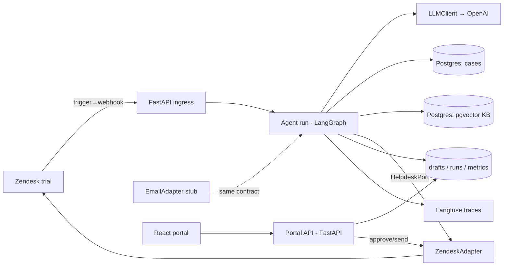

# Othram AI Support Agent — Design

## Architecture



Components: **ingress** (webhook receipt, idempotency, enqueue), **agent
core** (LangGraph graph), **helpdesk adapters** (port implementations),
**data layer** (cases, KB, runs/drafts/settings), **portal API + UI**,
**eval tooling** (labeled set, promptfoo, DeepEval, report generator),
**scenario runner** (live e2e + latency measurement).

## Interfaces (contracts between tickets)

### HelpdeskPort (Python Protocol) — T-2/T-3 boundary, consumed by T-5/T-6/T-8
```python
class HelpdeskPort(Protocol):
    def fetch_ticket(self, ticket_id: str) -> Ticket: ...
    def fetch_conversation(self, ticket_id: str) -> list[Message]: ...
    def post_public_reply(self, ticket_id: str, html_body: str) -> MessageRef: ...
    def post_internal_note(self, ticket_id: str, body: str) -> MessageRef: ...
    def add_tags(self, ticket_id: str, tags: list[str]) -> None: ...
    def set_status(self, ticket_id: str, status: TicketStatus) -> None: ...
    def assign_group(self, ticket_id: str, group: EscalationGroup) -> None: ...
```
Normalized models (Pydantic): `Ticket(id, subject, requester_email, status,
tags, created_at)`; `Message(id, author_kind: Literal["customer","agent","ai"],
text, public, created_at)`; `TicketStatus = Literal["new","open","pending","solved"]`.
Zendesk quirks (one comment per PUT, OAuth, backoff on 429/`Retry-After`)
live inside `ZendeskAdapter` only. The contract test suite is written once
against the Protocol and parametrized over adapters.

### Webhook ingress — T-4 boundary
`POST /webhooks/zendesk`, HMAC-SHA256 verified. Trigger payload (JSON via
placeholders): `{ticket_id, comment_id, requester_email, subject, latest_comment_text}`.
Idempotency key `(ticket_id, comment_id)` persisted in `tickets_seen`.
Loop guard: agent adds tag `ai-processed` on every write; the Zendesk trigger
carries the nullifying condition `tags not include ai-processed` per the
runbook, and ingress additionally drops events authored by the AI user.

### LLMClient isolation — T-5 boundary (provider swap layer)
```python
class LLMClient(Protocol):
    def structured(self, schema: type[BaseModel], messages: list[dict],
                   temperature: float = 0.0) -> BaseModel: ...
```
All model calls go through this. OpenAI impl uses strict structured outputs;
model version pinned in one config constant.

### Agent graph — T-5 internal, states pinned for T-6/T-8
LangGraph state: `RunState(ticket, conversation, topic, route, tool_results,
retrieved_chunks, draft, verifier_score, escalation, confidence, actions)`.
Nodes: `ingest → classify → route → {case_status | permission | kb_answer |
off_topic} → compose → verify → decide → act`. Routing values:
`Route = Literal["case_status","permission","kb","off_topic","escalate"]`.
`compose` fills templates for any case facts; free generation is allowed only
for connective prose and KB answers. `decide` consults the gate setting:
gate ON → persist draft `pending`; gate OFF → send via port.

### Escalation contract — T-6 boundary, consumed by T-7
Hard rules (deterministic, evaluated first): billing terms, explicit human
request, unknown/unresolvable case, out-of-procedure request, empty
retrieval, `verifier_score < 0.7`, classifier abstention. Classifier output:
`EscalationCall(escalate: bool, reasons: list[Reason], confidence: float)`
where `Reason = Literal["billing","human_request","unknown_case",
"out_of_procedure","low_confidence","frustration","complexity"]`.
Final decision = any hard rule OR (classifier escalate AND confidence ≥
threshold). Threshold chosen on the labeled set (T-7) and stored in config.

### Case system — T-1 boundary
Table `cases(case_id text pk, stage stage_enum, stage_entered_at, last_updated,
eta_weeks int, dna_profile_available bool, photos_available bool)` with
`stage_enum = intake|extraction|sequencing|genealogy|complete`. Lookup by
`case_id` or `requester_email`. Exposed to the agent as a typed tool function,
and read-only to the portal API.

### Portal API — T-8/T-9 boundary
`GET /api/feed?status=` → runs with draft/sent/route/confidence/reason/trace_url.
`PUT /api/drafts/{id}` (edit body) · `POST /api/drafts/{id}/approve` (sends via
port, records human-touched) · `POST /api/drafts/{id}/reject`.
`GET|PUT /api/settings/gate` → `{enabled: bool}`.
`GET /api/metrics` → `{human_avoidance_rate, latency_p50_s, latency_p95_s,
escalations_by_reason}`. Auth: `X-Portal-Token` shared secret.

### Metric definitions (pinned — do not renegotiate in tickets)
`human_avoidance_rate` = tickets solved via auto-sent replies only ÷ all
tickets reaching a terminal handling (solved or escalated). Gated approved
sends and escalations count against it. `latency` = webhook receipt →
public reply posted, autonomous mode only.

## Data models

Tables beyond `cases`: `kb_chunks(id, doc_slug, text, embedding vector)`;
`tickets_seen(ticket_id, comment_id, pk both)`; `runs(id, ticket_id, route,
confidence, outcome outcome_enum, verifier_score, trace_id, received_at,
replied_at)` with `outcome_enum = auto_sent|gated_sent|rejected|escalated|
off_topic`; `drafts(id, run_id, body, edited_body, status draft_enum)` with
`draft_enum = pending|approved|rejected|auto_sent`; `settings(key, value)`.
Labeled eval set is a repo fixture (`evals/labeled_set.yaml`), not a table:
`{id, subject, body, expected_route, expected_escalate, expected_reasons[]}`.

## Decisions & rationale

- **Templates for case facts, not free generation** — the only way "zero
  hallucinated case facts" becomes testable (R9). Agents must not "improve"
  this into free generation with a prompt instruction.
- **Stateless context rebuild from the Zendesk thread** (R7) — simpler and
  audit-friendly; LangGraph checkpointing deliberately unused. Rejected:
  persisted conversation state (drift risk vs. Zendesk as source of truth).
- **OAuth only** — Zendesk API tokens are on a staged removal schedule
  beginning 2026-07-28. Rejected: token Basic auth even for spikes.
- **Case facts never enter pgvector** — status answers are structured
  lookups. Rejected: RAG over case records (reintroduces hallucination
  surface for exactly the facts requiring 100% accuracy).
- **Gated sends count as human-touched** (R12) — keeps the graded metric
  honest; do not "fix" the numerator.
- **LangGraph over plain orchestration** — satisfies the portal's stack
  listing; the graph is shallow by design. Do not add checkpointing,
  interrupts, or subgraphs this scope doesn't need.
- **Macros: rejected** — preview-then-commit API adds risk for no demo value.

## Verification strategy

- **Unit + graph tests** (pytest, fake `LLMClient` returning canned
  structured outputs): routing, templates, escalation rules, gate behavior.
- **Contract suite** (`pytest -m contract`): HelpdeskPort behaviors over
  mocked HTTP (Zendesk) and fake transport (email), parametrized.
- **Grounding suite** (`pytest -m grounding`, DeepEval): R9 invariant +
  adversarial set; verifier threshold behavior.
- **Escalation evals** (promptfoo + report generator): labeled set → confusion
  matrix, PR curve; thresholds per R15. Run locally / pre-push.
- **Live e2e** (`pytest -m live`, excluded from CI): scenario runner against
  the Zendesk trial; asserts UI-visible effects via API reads and measures R8.
- **CI (GitHub Actions, cost-constrained)**: ruff + mypy + unit/contract/
  grounding markers only. Promptfoo evals and live e2e never run in Actions.
