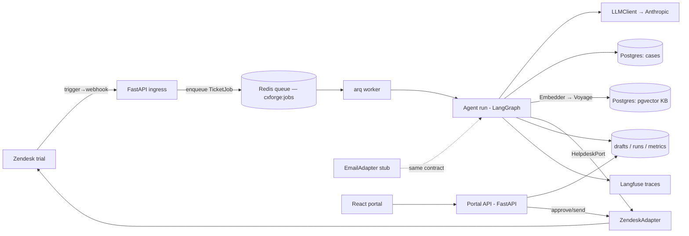

# Othram AI Support Agent — Design

**Amended in place 2026-08-16** under ADR-014. The decision record is
`docs/DECISIONS.md` (ADR-001…016) — read it for *why* any contract below looks the
way it does. `docs/STATE.md` is the verified account of what is actually built today;
`docs/BUILD-PLAN.md` is the remaining work, the waves and the file-ownership matrix.
This file states the contracts; it does not state progress. Where it and
`docs/STATE.md` disagree about status, `docs/STATE.md` wins.

## Architecture



Components: **ingress** (webhook receipt, idempotency, enqueue), **dispatch**
(Redis broker + a dedicated `arq` worker service — ADR-002), **agent
core** (LangGraph graph), **helpdesk adapters** (port implementations),
**data layer** (cases, KB, runs/drafts/settings), **portal API + UI**,
**eval tooling** (labeled set, promptfoo, route-accuracy harness, report generator),
**scenario runner** (live e2e + latency measurement).

> **Status, 2026-08-16 — the ingress→queue→worker hop is designed and frozen, not
> built.** The webhook handler's last statement is
> `return {"status": "accepted", "duplicate": not is_new}`
> (`backend/src/ingress/__init__.py:89`) and nothing in `backend/src` calls
> `run_agent`. **That was true when this was written and is no longer true of the working
> tree** — Wave 1 Track A built the ingress→queue→worker hop, and `backend/src/ingress`
> now enqueues a `TicketJob` that an arq worker consumes. It has not yet passed the full
> gate or been committed, and nothing here has ever opened a **real** Redis connection.
> Still genuinely target state: **the Voyage embedder edge** (the tree ships only
> `HashingEmbedder`; gated on `docs/OWNER-ACTIONS.md` OA-1) and **the Langfuse edge**
> (zero `import langfuse` repo-wide; Wave 2 Track C). See
> `docs/STATE.md §1–2` for the evidence and `docs/BUILD-PLAN.md §3 Track A` for who
> builds it. The contracts that hop must satisfy are frozen below.

## Interfaces (contracts between tickets)

### HelpdeskPort (Python Protocol) — T-2/T-3 boundary, consumed by T-5/T-6/T-8
```python
class HelpdeskPort(Protocol):
    def fetch_ticket(self, ticket_id: str) -> Ticket: ...
    def fetch_conversation(self, ticket_id: str) -> list[Message]: ...
    def post_public_reply(self, ticket_id: str, html_body: str) -> MessageRef: ...
    def post_internal_note(self, ticket_id: str, body: str) -> MessageRef: ...
    def add_tags(self, ticket_id: str, tags: list[str]) -> None: ...
    def set_status(self, ticket_id: str, status: TicketStatus) -> None: ...
    def assign_group(self, ticket_id: str, group: EscalationGroup) -> None: ...
```
Normalized models (Pydantic): `Ticket(id, subject, requester_email, status,
tags, created_at)`; `Message(id, author_kind: Literal["customer","agent","ai"],
text, public, created_at)`; `TicketStatus = Literal["new","open","pending","solved"]`.
Zendesk quirks (one comment per PUT, OAuth, backoff on 429/`Retry-After`)
live inside `ZendeskAdapter` only. The contract test suite is written once
against the Protocol and parametrized over adapters.

*Amendment 2026-08-16 (ADR-009):* this Protocol gains an eighth method,
`fetch_requester_history`, and a normalized `TicketSummary` model — the customer-history
capability SPEC R7.1 puts in scope. Signature frozen in §1.5 below. Both adapters
implement it and the parametrized suite covers both, so R14 is preserved.

### Webhook ingress — T-4 boundary
`POST /webhooks/zendesk`, HMAC-SHA256 verified over the RAW request body.
Trigger payload (JSON via placeholders): `{ticket_id, comment_id,
requester_email, subject, latest_comment_text, comment_author_id}`.
Idempotency key `(ticket_id, comment_id)` persisted in `tickets_seen`.
Loop guard: agent adds tag `ai-processed` on every write; the Zendesk trigger
carries the nullifying condition `tags not include ai-processed` per the
runbook, and ingress additionally drops events authored by the AI user.

`comment_author_id` (fed by the `{{current_user.id}}` placeholder) was added
during T-4: the original pinned payload carried no author field, so the
self-event drop this same paragraph requires was not implementable from it.
The field name is load-bearing in two places at once — `ingress.models` and
the trigger body in `docs/zendesk-runbook.md` — so renaming it requires
changing both in the same commit or the loop guard's second line silently
stops working.

*Amendment 2026-08-16 (ADR-002, ADR-004):* the "enqueue" half of this boundary — named
in §Architecture since the first draft and never built — is pinned in §1.1 below.
Ingress stamps UTC receipt time, enqueues a `TicketJob` **after** a successful,
non-duplicate `tickets_seen` insert, and returns the same `202` and the same body it
returns today.

### LLMClient isolation — T-5 boundary (provider swap layer)
```python
class LLMClient(Protocol):
    def structured(self, schema: type[BaseModel], messages: list[dict],
                   temperature: float = 0.0) -> BaseModel: ...
```
All model calls go through this. The implementation uses strict structured
outputs, with the model version pinned in one config constant.

**Provider: Anthropic (amended 2026-08-16 — ADR-014).** Planning pinned OpenAI on
this line; the build ships `AnthropicLLMClient` (`backend/src/agent/llm.py`) against
`ANTHROPIC_MODEL = "claude-opus-5"` (`backend/src/agent/config.py:23`). The pivot cost
exactly one module and changed no caller — which is the entire point of this seam, so
it is recorded here rather than edited out. Embeddings do **not** come through this
Protocol and are **not** Anthropic: Anthropic has no embeddings API, so the separate
`Embedder` seam takes Voyage (ADR-008; contract in §1.4 below). The provider story is
*Anthropic for generation, Voyage for embeddings*.

### Agent graph — T-5 internal, states pinned for T-6/T-8
LangGraph state: `RunState(ticket, conversation, topic, route, tool_results,
retrieved_chunks, draft, verifier_score, escalation, confidence, actions)`.
Nodes: `ingest → classify → route → {case_status | permission | kb_answer |
off_topic} → compose → verify → decide → act`. Routing values:
`Route = Literal["case_status","permission","kb","off_topic","escalate"]`.
`compose` fills templates for any case facts; free generation is allowed only
for connective prose and KB answers. `decide` consults the gate setting:
gate ON → persist draft `pending`; gate OFF → send via port.

*Amendment 2026-08-16 (ADR-004, ADR-009, ADR-010):* `run_agent` accepts an optional
injected `received_at` threaded to `act` (§1.2); `classify` additionally sees the
requester's prior-ticket history (§1.5); and KB retrieval applies a relevance floor
(§1.3), which is what makes the `empty_retrieval` hard trigger below reachable at all.
None of them changes the node set or the `Route` literal.

### Escalation contract — T-6 boundary, consumed by T-7
Hard rules (deterministic, evaluated first): billing terms, explicit human
request, unknown/unresolvable case, out-of-procedure request, empty
retrieval, `verifier_score < 0.7`, classifier abstention. Classifier output:
`EscalationCall(escalate: bool, reasons: list[Reason], confidence: float)`
where `Reason = Literal["billing","human_request","unknown_case",
"out_of_procedure","low_confidence","frustration","complexity"]`.
Final decision = any hard rule OR (classifier escalate AND confidence ≥
threshold). Threshold chosen on the labeled set (T-7) and stored in config.

### Case system — T-1 boundary
Table `cases(case_id text pk, stage stage_enum, stage_entered_at, last_updated,
eta_weeks int, dna_profile_available bool, photos_available bool)` with
`stage_enum = intake|extraction|sequencing|genealogy|complete`. Lookup by
`case_id` or `requester_email`. Exposed to the agent as a typed tool function,
and read-only to the portal API.

### Portal API — T-8/T-9 boundary
`GET /api/feed?status=` → runs with draft/sent/route/confidence/reason/trace_url.
`PUT /api/drafts/{id}` (edit body) · `POST /api/drafts/{id}/approve` (sends via
port, records human-touched) · `POST /api/drafts/{id}/reject`.
`GET|PUT /api/settings/gate` → `{enabled: bool}`.
`GET /api/metrics` → `{human_avoidance_rate, latency_p50_s, latency_p95_s,
escalations_by_reason}`. Auth: `X-Portal-Token` shared secret.

### Metric definitions (pinned — do not renegotiate in tickets)
`human_avoidance_rate` = tickets solved via auto-sent replies only ÷ all
tickets reaching a terminal handling (solved or escalated). Gated approved
sends and escalations count against it. `latency` = webhook receipt →
public reply posted, autonomous mode only.

> **The latency definition above stands unchanged — the *code* is what gets
> corrected (ADR-004).** As built, receipt time is minted at
> `backend/src/agent/nodes.py:591` (`received_at = datetime.now(UTC)`) inside `act`,
> the **last** node of the graph, so `replied_at - received_at` times only the
> HelpdeskPort calls and excludes ingest, classify, retrieval, compose, verify and
> decide — every model call. True webhook-receipt time is persisted nowhere:
> `tickets_seen` has no timestamp column and the ingress handler records no time.
> ADR-004 stamps receipt in the ingress handler, carries it on the job payload
> (§1.1) and injects it into `run_agent` → `act` (§1.2), after which
> `runs.received_at` finally means what this section has always said it means. Do
> not reword the definition to match the code; the code moves. See
> `docs/STATE.md §4.1`.

## Data models

Tables beyond `cases`: `kb_chunks(id, doc_slug, text, embedding vector)`;
`tickets_seen(ticket_id, comment_id, pk both)`; `runs(id, ticket_id, route,
confidence, outcome outcome_enum, verifier_score, trace_id, received_at,
replied_at, reasons text[])` with `outcome_enum = auto_sent|gated_sent|
rejected|escalated|off_topic`; `drafts(id, run_id, body, edited_body, status draft_enum)` with
`draft_enum = pending|approved|rejected|auto_sent`; `settings(key, value)`.
Labeled eval set is a repo fixture (`evals/labeled_set.yaml`), not a table:
`{id, subject, body, expected_route, expected_escalate, expected_reasons[]}`.

*Amendment 2026-08-16:* no table changes. `TicketSummary` (ADR-009) is a new
**normalized Pydantic model** in `helpdesk/models.py`, not a table — see §1.5.
`tickets_seen` keeps its two-column shape and `runs.received_at`/`replied_at` keep
their columns; only the *meaning* of `received_at` is corrected (§1.7). The Voyage
move is a **reseed of `kb_chunks`, not a migration** — `voyage-4-lite` at
`output_dimension=1024` matches the existing `EMBEDDING_DIM = 1024`
(`backend/src/data/embeddings.py:21`) and the `kb_chunks.embedding` column
(`backend/src/data/schema.py:101`, declared `embedding vector({EMBEDDING_DIM}) NOT NULL` —
the dimension is interpolated from that same constant, not a literal) exactly.

## Frozen interface contracts — 2026-08-16

The four parallel Wave-1 tracks build against these. They were fixed in work package
**W0.3** and are reproduced here from `docs/BUILD-PLAN.md §1` — every code block
byte-identical, the prose verbatim but for one added cross-reference in §1.5 — which stays
the plan of record for *who* builds each one and *when*. Each cites the ADR in
`docs/DECISIONS.md` that authorized it.

**They are frozen.** Per `.claude/rules/build-protocol.md` rule 5: if one of them is
wrong, stop, change it *here* in `docs/DESIGN.md` deliberately, and tell the other
tracks. Do not silently widen a signature mid-wave, and do not renegotiate one inside
a work package.

**Status, 2026-08-16 (Wave 1):** §1.1, §1.2 and §1.7 are **built** in the working tree —
`backend/src/worker/` exists, ingress enqueues, and `run_agent` takes the injected clock.
§1.3, §1.4, §1.5 and §1.6 are still target state (Wave 2). The signatures below are the
contract either way; the
system as built stops at a `202` (see the status note under §Architecture and
`docs/STATE.md §1–2`). §1.6 and §1.7 are the exceptions in kind — they pin things that
already exist and must be left alone.

### 1.1 Job payload (ADR-002)

```python
# backend/src/worker/jobs.py
class TicketJob(BaseModel):
    ticket_id: str
    comment_id: str
    received_at: datetime      # UTC, stamped in the ingress handler — ADR-004
```

arq task name: `run_ticket`. Queue name: `cxforge:jobs`. The handler enqueues
**after** the `tickets_seen` insert succeeds and **only** when `is_new` is true. The
endpoint keeps `status_code=202` and its existing response body unchanged — a failed
run never changes what Zendesk sees.

### 1.2 `run_agent` gains an injected clock (ADR-004)

```python
def run_agent(
    ticket_id: str,
    *,
    port: HelpdeskPort,
    llm: LLMClient,
    escalation_decider: EscalationDecider | None = None,
    received_at: datetime | None = None,     # NEW
) -> RunState: ...
```

`backend/src/agent/nodes.py:591` currently reads `received_at = datetime.now(UTC)`.
It becomes: use the injected value when present, else `datetime.now(UTC)`. The
fallback is what keeps all 78 existing graph/grounding/**escalation** tests passing
unchanged. (Counted 2026-08-16: `graph` 11 + `grounding` 11 = 22; + `escalation` 56 = **78**.
The figure was right and the label had dropped a directory.)

### 1.3 Retrieval relevance floor (ADR-010)

```python
def search_kb(
    query: str, k: int = 5, *, embedder: Embedder | None = None,
    min_score: float | None = None,          # NEW; defaults to config KB_MIN_SCORE
) -> list[RetrievedChunk]: ...
```

Chunks scoring below the floor are dropped. An empty result is what finally makes
R6's `empty_retrieval` hard trigger reachable. The floor is calibrated against
**Voyage** scores after the reseed — hashing-era numbers do not transfer.

### 1.4 Embedder (ADR-008)

The `Embedder` Protocol (`dim: int`, `embed(texts) -> list[list[float]]`) is already
the right seam and does not change. Add `VoyageEmbedder` alongside `HashingEmbedder`.

> **Use `voyage-4-lite` with `output_dimension=1024`** — verified against Voyage's
> model reference on 2026-08-16. The `voyage-4` line supports configurable output
> dimensions (256 / 512 / 1024 / 2048), and pinning 1024 matches the current
> `EMBEDDING_DIM = 1024` and the `kb_chunks.embedding vector(1024)` column exactly:
> **reseed only, no schema migration.**
>
> Do not use `voyage-3` (legacy, fixed 1024) or `voyage-3-lite` (legacy, fixed 512 —
> would force a column change). Pass `output_dimension` explicitly rather than
> relying on the default, so the contract is visible at the call site.

`HashingEmbedder` stays in the tree as the offline default so CI and the non-live
suite keep running with no network and no key.

### 1.5 Customer history (ADR-009)

```python
# backend/src/helpdesk/port.py  — the T-2/T-3 boundary. This is the sign-off (ADR-009).
class HelpdeskPort(Protocol):
    ...
    def fetch_requester_history(
        self, requester_email: str, *, exclude_ticket_id: str, limit: int = 5
    ) -> list[TicketSummary]: ...
```

`TicketSummary` is a new normalized model in `helpdesk/models.py`:
`(id, subject, status, created_at, tags)`. Both adapters implement it; the
parametrized contract suite covers it for both (R14). This is the port contract
behind SPEC R7.1.

### 1.6 Tracing (ADR-006)

Spans are keyed on the **`trace_id` already minted in `act`** — do not mint a second
one. `portal/service.py::_trace_url` keeps its URL shape and finally resolves.

### 1.7 What does *not* change

`tickets_seen` keeps its two-column shape — receipt time rides on the job payload,
not the table (ADR-003 releases the row on failure rather than tracking state on it).
The `runs.received_at` / `replied_at` columns already exist; only their *meaning* is
corrected. The pinned `202` and the **8 `== 202` assertions across 6 tests** in
`backend/tests/ingress/test_webhook.py` are preserved.

> **Added to the frozen set 2026-08-16, after Wave 1 exposed the gaps.** §1.1 pinned the
> queue and task names but not two things both Tracks A and F needed: the Redis URL env var
> is **`REDIS_URL`**, and the worker container's command is
> **`arq worker.main.WorkerSettings`**. Both tracks picked these independently and agreed —
> but agreement by luck is not a contract, and a rename on either side would have diverged
> silently. They are frozen now.
>
> Also frozen by omission and worth stating: the app reads **`LANGFUSE_HOST`**
> (`backend/src/portal/service.py:77`), **not** `LANGFUSE_BASE_URL`. It defaults to
> `https://cloud.langfuse.com`, while the `cxforge` project lives on
> `https://us.cloud.langfuse.com` — so a missing `LANGFUSE_HOST` does not fail loudly, it
> silently builds trace URLs pointing at the wrong Langfuse region.

## Decisions & rationale

- **Templates for case facts, not free generation** — the only way "zero
  hallucinated case facts" becomes testable (R9). Agents must not "improve"
  this into free generation with a prompt instruction.
- **Stateless context rebuild from the Zendesk thread** (R7) — simpler and
  audit-friendly; LangGraph checkpointing deliberately unused. Rejected:
  persisted conversation state (drift risk vs. Zendesk as source of truth).
- **OAuth only** — Zendesk API tokens are on a staged removal schedule
  beginning 2026-07-28. Rejected: token Basic auth even for spikes.
- **Case facts never enter pgvector** — status answers are structured
  lookups. Rejected: RAG over case records (reintroduces hallucination
  surface for exactly the facts requiring 100% accuracy).
- **Gated sends count as human-touched** (R12) — keeps the graded metric
  honest; do not "fix" the numerator.
- **LangGraph over plain orchestration** — satisfies the portal's stack
  listing; the graph is shallow by design. Do not add checkpointing,
  interrupts, or subgraphs this scope doesn't need.
- **Macros: rejected** — preview-then-commit API adds risk for no demo value.

## Verification strategy

- **Unit + graph tests** (pytest, fake `LLMClient` returning canned
  structured outputs): routing, templates, escalation rules, gate behavior.
- **Contract suite** (`pytest -m contract`): HelpdeskPort behaviors over
  mocked HTTP (Zendesk) and fake transport (email), parametrized.
- **Grounding suite** (`pytest -m grounding`): R9 invariant + adversarial set;
  verifier threshold behavior. Enforced by the pure-Python, judge-independent
  `grounding_guard` — **no DeepEval, removed 2026-08-16** (see below).
- **Escalation evals** (promptfoo + report generator): labeled set → confusion
  matrix, PR curve; thresholds per R15. Run locally / pre-push.
- **Live e2e** (`pytest -m live`, excluded from CI): scenario runner against
  the Zendesk trial; asserts UI-visible effects via API reads and measures R8.
- **CI (GitHub Actions, cost-constrained)**: ruff + mypy + unit/contract/
  grounding markers only. Promptfoo evals and live e2e never run in Actions.

**Tooling status, 2026-08-16 (ADR-013).** Three of the tools named above do nothing
yet, and this section must not be read as claiming otherwise:

- **promptfoo — scaffold only.** `promptfooconfig.yaml` is still the T-1 stub: a
  placeholder prompt string and `tests: []`. promptfoo is not installed. What *is*
  real for R15 is `evals/report.py` and the published eval-report artifact it
  generates — read `docs/STATE.md §4.2` for what that artifact's headline numbers do
  and do not rest on. promptfoo is the *second, independent* evidence stream, and it
  has not been built. ADR-013 commits to building it over the canonical scenarios and
  the adversarial grounding set (`docs/BUILD-PLAN.md §3 Track E`), with the bar that
  it must fail when the prompt is degraded.
- **DeepEval — REMOVED 2026-08-16 (ADR-013 condition settled).** It was a declared
  dependency with zero imports repo-wide. Four measured grounds for removal rather than
  adoption: (1) nothing imported it, so nothing regresses; (2) it contradicts R9's design
  — enforcement is the pure-Python, judge-independent `grounding_guard`, chosen after a
  T-5 red-team finding *specifically* so a groundedness score cannot buy its way past it,
  and DeepEval's entire value is model-judged metrics; (3) verified against
  `deepeval 4.1.8`, `deepeval.metrics.utils.initialize_model` falls through to
  `OpenAIModel` when no model is passed, and the repo's `.env` still carries a pre-pivot
  `OPENAI_API_KEY` it would find — so adopting it reintroduces OpenAI to a codebase whose
  isolation story is the Anthropic pivot (ADR-008/ADR-014); (4) its metrics make live
  judge calls and it ships opt-out telemetry, breaking the gated suite's offline
  guarantee. ADR-013's requirement of *a second, independent evidence stream* is met by
  the promptfoo suite instead. `backend/tests/grounding/test_no_unused_eval_dependency.py`
  encodes the **rule, not the outcome** — it passes on removal, and equally on someone
  making a declared eval dependency do real work.
- **Langfuse — installed, imported nowhere (ADR-006).** `act` mints a bare
  `uuid.uuid4().hex` trace id and reports it to no one, and
  `portal/service.py::_trace_url` builds a conventional-shape URL from it that cannot
  resolve. §1.6 above freezes the contract; W2-C1 instruments it.
