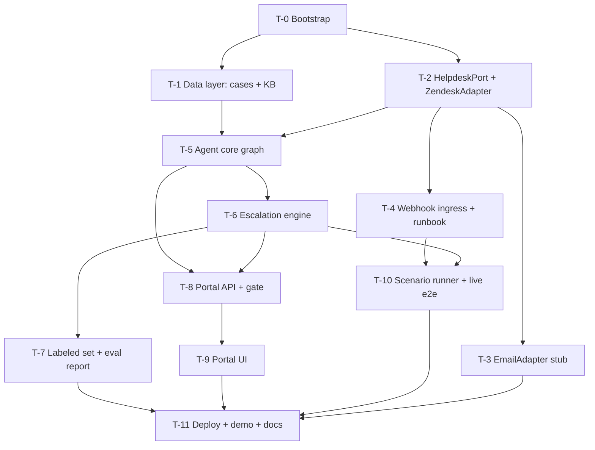

# Othram AI Support Agent — Task Graph

Human-readable mirror. `docs/tickets.json` is authoritative — the hooks and
native-Tasks ingestion read it.

**Merge order for parallel worktrees**: ascending ticket ID, always
(e.g. T-1 merges before T-2; T-8 before T-9 before T-10).

## Dependency graph

Parallel waves are computed at execution time; disjoint-scope tickets are
marked `parallel_safe`.

## Tickets

### T-0: Repo bootstrap and test harness
- **Objective**: Monorepo skeleton so every downstream verify command runs.
- **Refs**: SPEC §Constraints, DESIGN §Verification strategy
- **Acceptance**: 1) `backend/` (FastAPI app stub), `portal/` (Vite React TS
  stub), `evals/`, `docs/` exist; 2) docker-compose brings up Postgres 16 +
  pgvector healthy; 3) pytest markers `contract`, `grounding`, `live`
  registered; 4) GitHub Actions workflow runs ruff + mypy + `pytest -m "not
  live"` only; 5) promptfoo config stub and `.env.example` present.
- **Verify**: `docker compose up -d db && uv run pytest && uv run ruff check . && uv run mypy backend`
- **Scope**: repo root, `backend/**`, `portal/**` (scaffold only), `.github/**`
- **Depends on**: none
- **Non-goals**: no business logic, no portal components beyond scaffold.

### T-1: Data layer — case system and KB fixtures
- **Objective**: Fictional-lab case DB and KB the agent grounds in (R2, R4).
- **Refs**: R2, R4, DESIGN §Case system, §Data models
- **Acceptance**: 1) `cases` schema + idempotent seeder, ~30 cases covering
  every stage incl. edge cases (just-submitted, complete, stale); 2) ~15
  fictional SOP/policy/service docs authored under `fixtures/kb/`, chunked
  and embedded into `kb_chunks`; 3) typed lookup functions (by case_id, by
  requester_email) with miss returning a typed NotFound; 4) retrieval smoke
  test returns the relevant chunk for 5 sample queries.
- **Verify**: `uv run pytest backend/tests/data -q`
- **Scope**: `backend/src/data/**`, `fixtures/**`, `backend/tests/data/**`
- **Depends on**: T-0
- **Non-goals**: no ingestion pipeline; no real-lab content. `parallel_safe`
  with T-2.

### T-2: HelpdeskPort, ZendeskAdapter, contract suite
- **Objective**: The port boundary and its full Zendesk implementation (R1
  write-side, R14 foundation).
- **Refs**: R14, DESIGN §HelpdeskPort
- **Acceptance**: 1) Protocol + normalized models exactly as pinned; 2)
  OAuth client (no API tokens), backoff honoring `Retry-After`; 3) all port
  ops implemented — public reply and internal note as separate PUTs; every
  write appends the `ai-processed` tag; 4) contract suite written against
  the Protocol, parametrized by adapter, passing over mocked Zendesk HTTP;
  5) `scripts/live_smoke.py` exercising each op against a real trial (manual
  run, env-gated).
- **Verify**: `uv run pytest -m contract -q`
- **Scope**: `backend/src/helpdesk/**`, `backend/tests/contract/**`, `scripts/live_smoke.py`
- **Depends on**: T-0
- **Non-goals**: no macros; no email adapter (T-3). `parallel_safe` with T-1.

### T-3: EmailAdapter stub
- **Objective**: Prove the port is swappable — the differentiation artifact
  (R14).
- **Refs**: R14, DESIGN §HelpdeskPort
- **Acceptance**: 1) EmailAdapter over an in-memory fake transport passes the
  identical parametrized contract suite; 2) README section stating exactly
  what a production email channel would add (IMAP polling, threading via
  Message-ID) without implementing it.
- **Verify**: `uv run pytest -m contract -q`
- **Scope**: `backend/src/helpdesk/email_adapter.py`, contract test params
- **Depends on**: T-2
- **Non-goals**: no real SMTP/IMAP. Stub stays a stub. `parallel_safe` with
  T-4/T-5.

### T-4: Webhook ingress and Zendesk setup runbook
- **Objective**: Exactly-once, loop-safe ticket event intake (R1).
- **Refs**: R1, DESIGN §Webhook ingress
- **Acceptance**: 1) HMAC-verified endpoint matching the pinned payload; 2)
  idempotency via `tickets_seen` — duplicate (ticket, comment) events are
  no-ops; 3) events authored by the AI user are dropped; 4)
  `docs/zendesk-runbook.md` covers the human steps: trial signup, OAuth app,
  AI agent user, trigger with `tags not include ai-processed` nullifier,
  webhook + signing secret, cloudflared; 5) unit tests for HMAC
  reject/accept, dedupe, self-event drop.
- **Verify**: `uv run pytest backend/tests/ingress -q`
- **Scope**: `backend/src/ingress/**`, `backend/tests/ingress/**`, `docs/zendesk-runbook.md`
- **Depends on**: T-2
- **Non-goals**: no polling fallback unless the trial blocks webhooks (if it
  does: stop, re-plan). `parallel_safe` with T-5 after T-2.

### T-5: Agent core graph
- **Objective**: The LangGraph run: classify → route → ground → compose →
  verify → decide → act (R2–R5, R7, R9, R11-decide).
- **Refs**: R2–R5, R7, R9, DESIGN §Agent graph, §LLMClient
- **Acceptance**: 1) graph nodes/state exactly as pinned; 2) all model calls
  through `LLMClient`; OpenAI impl with strict structured outputs, pinned
  model constant; 3) case facts reach drafts only via templates fed by tool
  results; 4) verifier node scores KB drafts, threshold from config; 5) gate
  setting respected in `decide`; 6) graph tests with a fake LLMClient cover
  the four canonical scenarios end-to-end in-process; 7) grounding suite:
  adversarial unknown-case and false-premise inputs produce escalation or
  refusal, never invented facts.
- **Verify**: `uv run pytest backend/tests/graph -q && uv run pytest -m grounding -q`
- **Scope**: `backend/src/agent/**`, `backend/tests/graph/**`, `backend/tests/grounding/**`
- **Depends on**: T-1, T-2
- **Non-goals**: no checkpointing/interrupts/subgraphs; no escalation rule
  logic beyond calling T-6's interface (stub until T-6 lands).

### T-6: Escalation engine
- **Objective**: Hard rules + classifier + internal-note composition (R6).
- **Refs**: R6, DESIGN §Escalation contract
- **Acceptance**: 1) hard rules exactly as pinned, deterministic, unit-tested
  individually; 2) classifier via LLMClient emitting `EscalationCall`; 3)
  final-decision combinator (rule OR classifier≥threshold); 4) internal note
  contains summary, grounded facts, reason enum; customer notice posted; 5)
  wired into T-5's `decide`/`act`.
- **Verify**: `uv run pytest backend/tests/escalation -q`
- **Scope**: `backend/src/escalation/**`, `backend/tests/escalation/**`
- **Depends on**: T-5
- **Non-goals**: no threshold tuning (T-7 owns it); no sentiment model beyond
  the classifier prompt.

### T-7: Labeled set and escalation eval report
- **Objective**: The flagship credibility artifact — measured
  precision/recall on escalation (R15).
- **Refs**: R15, DESIGN §Verification strategy
- **Acceptance**: 1) `evals/labeled_set.yaml` with ~50 tickets spanning all
  routes, all hard triggers, fuzzy frustration/complexity cases, and
  adversarial phrasing; 2) **human gate: labels reviewed and approved by the
  project owner before use — record approval in the fixture header**; 3)
  promptfoo run + report generator producing confusion matrix, P/R/F1, PR
  curve image with chosen threshold marked; 4) recall ≥ 0.95 on the
  hard-trigger subset at the committed threshold; threshold written to
  config; 5) report lands in `docs/eval-report/`.
- **Verify**: `uv run python -m evals.report && uv run pytest backend/tests/evals -q`
- **Scope**: `evals/**`, `docs/eval-report/**`, escalation threshold config
- **Depends on**: T-6
- **Non-goals**: no expanding the set past ~60; no synthetic label approval —
  the human sign-off is external ground truth, not skippable.

### T-8: Portal API and approval gate
- **Objective**: Feed, draft edit/approve/reject, gate toggle, metrics (R10–R13).
- **Refs**: R10–R13, DESIGN §Portal API, §Metric definitions
- **Acceptance**: 1) endpoints exactly as pinned, `X-Portal-Token` auth; 2)
  gate ON holds drafts `pending`; approve sends via HelpdeskPort and records
  `gated_sent`; 3) metrics computed per the pinned definitions — gated sends
  excluded from the human-avoidance numerator; 4) API tests cover both gate
  states and metric math.
- **Verify**: `uv run pytest backend/tests/portal -q`
- **Scope**: `backend/src/portal/**`, `backend/tests/portal/**`
- **Depends on**: T-5, T-6
- **Non-goals**: no UI (T-9); no real auth/multi-user. `parallel_safe` with
  T-7.

### T-9: Portal UI
- **Objective**: The reviewer-facing React surface (R10–R12) and demo
  centerpiece.
- **Refs**: R10–R12, DESIGN §Portal API
- **Acceptance**: 1) feed view with route/confidence/reason/trace link; 2)
  draft detail with editable body, approve/reject; 3) gate toggle; 4) metrics
  panel (R13); 5) builds clean; component tests for gate and edit-approve
  flows against a mocked API.
- **Verify**: `cd portal && npm run build && npm test`
- **Scope**: `portal/**`
- **Depends on**: T-8
- **Non-goals**: no styling beyond clean-and-readable; no websockets —
  polling is fine. `parallel_safe` with T-7, T-10.

### T-10: Scenario runner and live e2e
- **Objective**: Prove the system against real Zendesk and measure R8.
- **Refs**: R8, SPEC §Success criteria 1 & 6
- **Acceptance**: 1) runner seeds the four canonical scenarios + adversarial
  unknown-case via Zendesk API (respecting rate limits); 2) asserts
  UI-visible effects by API read-back (reply present, note on escalation,
  tags, status); 3) emits latency report (p50/p95 webhook→reply); 4) p95 <
  5 min against the deployed or tunneled instance; 5) marked `-m live`,
  excluded from CI.
- **Verify**: `uv run pytest -m live -q` (env-gated; requires runbook completed)
- **Scope**: `backend/tests/live/**`, `scripts/scenario_runner.py`
- **Depends on**: T-4, T-6
- **Non-goals**: no load testing beyond demo volume.

### T-11: Deploy, demo assets, technical documentation
- **Objective**: Everything the grader touches (SPEC §Success criteria 5–7).
- **Refs**: SPEC §Constraints, §Success criteria
- **Acceptance**: 1) docker-compose deploy on a DigitalOcean droplet,
  reachable, env documented; 2) `docs/` assembled: architecture (+ diagram),
  grounding design, escalation methodology with the T-7 report, portability
  section (port + both adapters, naming Gorgias/Intercom/Front as future
  adapters), runbook; 3) demo script/shot list: five live scenarios, gate
  flip + edited-approve on camera, metrics panel, one Langfuse trace showing
  tool result → templated reply; 4) README quickstart verified from clean
  clone.
- **Verify**: `bash scripts/verify_deploy.sh` (health checks + docs links) 
- **Scope**: `docs/**`, `deploy/**`, `scripts/verify_deploy.sh`, README
- **Depends on**: T-3, T-7, T-9, T-10
- **Non-goals**: no video editing tooling; recording is a human step.
