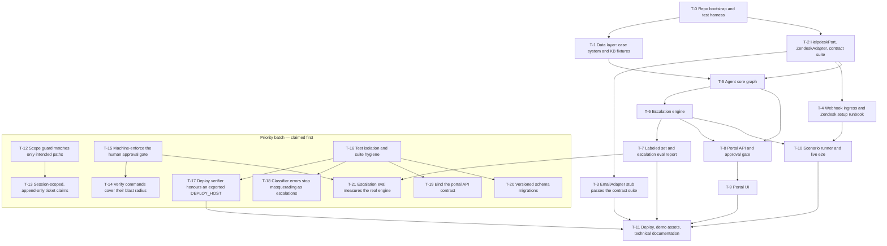

# othram-support-agent — Task Graph

Human-readable mirror. `docs/tickets.json` is authoritative — the hooks and
native-Tasks ingestion read it. **This file is GENERATED from
docs/tickets.json by `scripts/render_tasks_md.py` (T-14) — do not hand-edit
it. Run `uv run python scripts/render_tasks_md.py` after any change to
docs/tickets.json and commit the result.**

**Merge order for parallel worktrees**: ascending ticket ID, always
(e.g. T-1 merges before T-2; T-8 before T-9 before T-10).

**Pick order**: tickets carrying `"priority": "next"` are claimed BEFORE the
ascending-ID default. See the "Priority batch" section below for that set.
Merge order within the batch is still ascending ID.

## Dependency graph

Parallel waves are computed at execution time; disjoint-scope tickets are
marked `parallel_safe`.

## Tickets

### T-0: Repo bootstrap and test harness
- **Objective**: Monorepo skeleton so every downstream verify command runs.
- **Refs**: SPEC#constraints, DESIGN#verification-strategy
- **Acceptance**:
  1. backend/ (FastAPI app stub), portal/ (Vite React TS stub), evals/, docs/ exist
  2. docker-compose brings up Postgres 16 + pgvector healthy
  3. pytest markers contract, grounding, live registered
  4. GitHub Actions workflow runs ruff + mypy + pytest -m 'not live' only
  5. promptfoo config stub and .env.example present
- **Verify**: `docker compose up -d db && uv run pytest -m "not live" && uv run ruff check . && uv run mypy backend && cd portal && npm run build && npm test`
- **Scope**: `backend/**`, `portal/**`, `.github/**`, `docker-compose.yml`, `pyproject.toml`, `.env.example`, `promptfooconfig.yaml`, `evals/**`, `.gitignore`, `uv.lock`
- **Depends on**: none
- **Non-goals**:
  - No business logic
  - No portal components beyond scaffold
- **Parallel safe**: no
- **Priority**: default
- **Status**: closed

### T-1: Data layer: case system and KB fixtures
- **Objective**: Fictional-lab case DB and KB the agent grounds in (R2, R4).
- **Refs**: R2, R4, DESIGN#case-system, DESIGN#data-models
- **Acceptance**:
  1. cases schema + idempotent seeder, ~30 cases covering every stage incl. edge cases (just-submitted, complete, stale)
  2. ~15 fictional SOP/policy/service docs authored under fixtures/kb/, chunked and embedded into kb_chunks
  3. typed lookup functions (by case_id, by requester_email) with miss returning a typed NotFound
  4. retrieval smoke test returns the relevant chunk for 5 sample queries
- **Verify**: `uv run pytest -m "not live" backend/tests/data backend/tests/escalation backend/tests/evals backend/tests/graph backend/tests/grounding backend/tests/ingress backend/tests/portal backend/tests/test_bootstrap.py -q`
- **Scope**: `backend/src/data/**`, `fixtures/**`, `backend/tests/data/**`
- **Depends on**: T-0
- **Non-goals**:
  - No ingestion pipeline
  - No real-lab content
- **Parallel safe**: yes
- **Priority**: default
- **Status**: closed

### T-2: HelpdeskPort, ZendeskAdapter, contract suite
- **Objective**: The port boundary and its full Zendesk implementation (R1 write-side, R14 foundation).
- **Refs**: R14, DESIGN#helpdeskport
- **Acceptance**:
  1. Protocol + normalized models exactly as pinned in DESIGN
  2. OAuth client (no API tokens), backoff honoring Retry-After
  3. all port ops implemented; public reply and internal note as separate PUTs; every write appends the ai-processed tag
  4. contract suite written against the Protocol, parametrized by adapter, passing over mocked Zendesk HTTP
  5. scripts/live_smoke.py exercising each op against a real trial (manual run, env-gated)
- **Verify**: `uv run pytest -m "not live" backend/tests/contract backend/tests/escalation backend/tests/evals backend/tests/graph backend/tests/grounding backend/tests/ingress backend/tests/portal backend/tests/test_bootstrap.py -q`
- **Scope**: `backend/src/helpdesk/**`, `backend/tests/contract/**`, `scripts/live_smoke.py`
- **Depends on**: T-0
- **Non-goals**:
  - No macros
  - No email adapter (T-3)
- **Parallel safe**: yes
- **Priority**: default
- **Status**: closed

### T-3: EmailAdapter stub passes the contract suite
- **Objective**: Prove the port is swappable — the differentiation artifact (R14).
- **Refs**: R14, DESIGN#helpdeskport
- **Acceptance**:
  1. EmailAdapter over an in-memory fake transport passes the identical parametrized contract suite
  2. README section stating exactly what a production email channel would add (IMAP polling, threading via Message-ID) without implementing it
- **Verify**: `uv run pytest -m "not live" -q`
- **Scope**: `backend/src/helpdesk/email_adapter.py`, `backend/tests/contract/**`, `README.md`
- **Depends on**: T-2
- **Non-goals**:
  - No real SMTP/IMAP — the stub stays a stub
- **Parallel safe**: yes
- **Priority**: default
- **Status**: closed

### T-4: Webhook ingress and Zendesk setup runbook
- **Objective**: Exactly-once, loop-safe ticket event intake (R1).
- **Refs**: R1, DESIGN#webhook-ingress
- **Acceptance**:
  1. HMAC-verified endpoint matching the pinned payload
  2. idempotency via tickets_seen — duplicate (ticket, comment) events are no-ops
  3. events authored by the AI user are dropped
  4. docs/zendesk-runbook.md covers the human steps: trial signup, OAuth app, AI agent user, trigger with 'tags not include ai-processed' nullifier, webhook + signing secret, cloudflared
  5. unit tests for HMAC reject/accept, dedupe, self-event drop
- **Verify**: `uv run pytest -m "not live" backend/tests/ingress backend/tests/portal backend/tests/test_bootstrap.py -q`
- **Scope**: `backend/src/ingress/**`, `backend/tests/ingress/**`, `docs/zendesk-runbook.md`
- **Depends on**: T-2
- **Non-goals**:
  - No polling fallback unless the trial blocks webhooks — if it does, STOP and tell the human (plan defect)
- **Parallel safe**: yes
- **Priority**: default
- **Status**: closed

### T-5: Agent core graph
- **Objective**: The LangGraph run: classify, route, ground, compose, verify, decide, act (R2–R5, R7, R9, R11 decide-side).
- **Refs**: R2, R3, R4, R5, R7, R9, DESIGN#agent-graph, DESIGN#llmclient
- **Acceptance**:
  1. graph nodes/state exactly as pinned in DESIGN
  2. all model calls through LLMClient; OpenAI impl with strict structured outputs, pinned model constant
  3. case facts reach drafts only via templates fed by tool results
  4. verifier node scores KB drafts, threshold from config
  5. gate setting respected in decide
  6. graph tests with a fake LLMClient cover the four canonical scenarios end-to-end in-process
  7. grounding suite: adversarial unknown-case and false-premise inputs produce escalation or refusal, never invented facts
- **Verify**: `uv run pytest -m "not live" backend/tests/escalation backend/tests/evals backend/tests/graph backend/tests/grounding backend/tests/ingress backend/tests/portal backend/tests/test_bootstrap.py -q`
- **Scope**: `backend/src/agent/**`, `backend/tests/graph/**`, `backend/tests/grounding/**`
- **Depends on**: T-1, T-2
- **Non-goals**:
  - No checkpointing/interrupts/subgraphs
  - No escalation rule logic beyond calling T-6's interface (stub until T-6 lands)
- **Parallel safe**: no
- **Priority**: default
- **Status**: closed

### T-6: Escalation engine
- **Objective**: Hard rules + classifier + internal-note composition (R6).
- **Refs**: R6, DESIGN#escalation-contract
- **Acceptance**:
  1. hard rules exactly as pinned, deterministic, unit-tested individually
  2. classifier via LLMClient emitting EscalationCall
  3. final-decision combinator (rule OR classifier >= threshold)
  4. internal note contains summary, grounded facts, reason enum; customer notice posted
  5. wired into T-5's decide/act
- **Verify**: `uv run pytest -m "not live" backend/tests/escalation backend/tests/evals backend/tests/graph backend/tests/grounding backend/tests/ingress backend/tests/portal backend/tests/test_bootstrap.py -q`
- **Scope**: `backend/src/escalation/**`, `backend/tests/escalation/**`, `backend/src/agent/**`, `backend/tests/graph/**`, `backend/tests/grounding/**`
- **Depends on**: T-5
- **Non-goals**:
  - No threshold tuning (T-7 owns it)
  - No sentiment model beyond the classifier prompt
- **Parallel safe**: no
- **Priority**: default
- **Status**: closed

### T-7: Labeled set and escalation eval report
- **Objective**: The flagship credibility artifact — measured precision/recall on escalation (R15).
- **Refs**: R15, DESIGN#verification-strategy
- **Acceptance**:
  1. evals/labeled_set.yaml with ~50 tickets spanning all routes, all hard triggers, fuzzy frustration/complexity cases, adversarial phrasing
  2. HUMAN GATE: labels reviewed and approved by the project owner before use — record approval in the fixture header; stop and ask, never self-approve
  3. promptfoo run + report generator producing confusion matrix, P/R/F1, PR curve image with chosen threshold marked
  4. recall >= 0.95 on the hard-trigger subset at the committed threshold; threshold written to escalation config
  5. report lands in docs/eval-report/
- **Verify**: `uv run python -c "import yaml; a=yaml.safe_load(open('evals/labeled_set.yaml'))['approval']; import sys; sys.exit(0 if a.get('status')=='APPROVED' and a.get('approved_by') and a.get('approved_date') else 1)" && uv run python -m evals.report && uv run pytest -m "not live" backend/tests/escalation backend/tests/evals backend/tests/graph backend/tests/grounding backend/tests/ingress backend/tests/portal backend/tests/test_bootstrap.py -q`
- **Scope**: `evals/**`, `backend/tests/evals/**`, `backend/src/escalation/**`
- **Depends on**: T-6
- **Non-goals**:
  - No expanding the set past ~60
  - No synthetic label approval — human sign-off is external ground truth
- **Parallel safe**: yes
- **Priority**: default
- **Status**: open

### T-8: Portal API and approval gate
- **Objective**: Feed, draft edit/approve/reject, gate toggle, metrics (R10–R13).
- **Refs**: R10, R11, R12, R13, DESIGN#portal-api, DESIGN#metric-definitions
- **Acceptance**:
  1. endpoints exactly as pinned, X-Portal-Token auth
  2. gate ON holds drafts pending; approve sends via HelpdeskPort and records gated_sent
  3. metrics computed per the pinned definitions — gated sends excluded from the human-avoidance numerator
  4. API tests cover both gate states and metric math
- **Verify**: `uv run pytest -m "not live" backend/tests/data backend/tests/escalation backend/tests/evals backend/tests/graph backend/tests/grounding backend/tests/ingress backend/tests/portal backend/tests/test_bootstrap.py -q`
- **Scope**: `backend/src/portal/**`, `backend/tests/portal/**`, `backend/src/data/**`, `backend/src/agent/**`
- **Depends on**: T-5, T-6
- **Non-goals**:
  - No UI (T-9)
  - No real auth/multi-user
- **Parallel safe**: yes
- **Priority**: default
- **Status**: closed

### T-9: Portal UI
- **Objective**: The reviewer-facing React surface (R10–R12) and demo centerpiece.
- **Refs**: R10, R11, R12, DESIGN#portal-api
- **Acceptance**:
  1. feed view with route/confidence/reason/trace link
  2. draft detail with editable body, approve/reject
  3. gate toggle
  4. metrics panel (R13)
  5. builds clean; component tests for gate and edit-approve flows against a mocked API
- **Verify**: `cd portal && npm run build && npm test`
- **Scope**: `portal/**`
- **Depends on**: T-8
- **Non-goals**:
  - No styling beyond clean-and-readable
  - No websockets — polling is fine
- **Parallel safe**: yes
- **Priority**: default
- **Status**: closed

### T-10: Scenario runner and live e2e
- **Objective**: Prove the system against real Zendesk and measure R8.
- **Refs**: R8, SPEC#success-criteria
- **Acceptance**:
  1. runner seeds the four canonical scenarios + adversarial unknown-case via Zendesk API (respecting rate limits)
  2. asserts UI-visible effects by API read-back (reply present, note on escalation, tags, status)
  3. emits latency report (p50/p95 webhook to reply)
  4. p95 < 5 min against the deployed or tunneled instance
  5. marked -m live, excluded from CI; requires the runbook completed by the human first
- **Verify**: `uv run pytest -m live -q`
- **Scope**: `backend/tests/live/**`, `scripts/scenario_runner.py`
- **Depends on**: T-4, T-6
- **Non-goals**:
  - No load testing beyond demo volume
- **Parallel safe**: yes
- **Priority**: default
- **Status**: open

### T-11: Deploy, demo assets, technical documentation
- **Objective**: Everything the grader touches (SPEC success criteria 5–7).
- **Refs**: SPEC#constraints, SPEC#success-criteria
- **Acceptance**:
  1. docker-compose deploy on a DigitalOcean droplet, reachable, env documented
  2. docs/ assembled: architecture (+ diagram), grounding design, escalation methodology with the T-7 report, portability section (port + both adapters, naming Gorgias/Intercom/Front as future adapters), runbook
  3. demo script/shot list: five live scenarios, gate flip + edited-approve on camera, metrics panel, one Langfuse trace showing tool result to templated reply
  4. README quickstart verified from clean clone
- **Verify**: `uv run pytest backend/tests/deploy backend/tests/hooks -q`
- **Scope**: `docs/**`, `deploy/**`, `scripts/verify_deploy.sh`, `README.md`
- **Depends on**: T-3, T-7, T-9, T-10, T-17
- **Non-goals**:
  - No video editing tooling — recording is a human step
- **Parallel safe**: no
- **Priority**: default
- **Status**: open

## Priority batch — remediation

Raised from defects observed during the T-0–T-11 build, verified against the
repository, revised, and re-verified. These carry `"priority": "next"` in
`docs/tickets.json` and are claimed before the ascending-ID default.
GENERATED FROM tickets.json — do not hand-edit; T-14 made this rendering a
committed script (`scripts/render_tasks_md.py`).

### T-12: Scope guard matches only intended paths
- **Objective**: scope_guard.sh admits paths it should deny and denies paths it should ignore; make its matching exact and give the hook its own tests.
- **Refs**: OBS#W2, OBS#W3, CLAUDE.md#rule-4
- **Acceptance**:
  1. glob-to-regex match is anchored at BOTH ends; with scope portal/** the path backend/src/portal/routes.py is DENIED (regression test, this exact pair)
  2. a path that does not resolve under CLAUDE_PROJECT_DIR exits 0 (out-of-repo scratch is never the scope guard's business), compared after realpath so ../ traversal cannot escape scope
  3. a missing or empty .claude/active-ticket fails CLOSED (deny). There is no bypass token, sentinel or env var an agent can issue itself — unclaimed work is authorised by a human editing the claim record, nothing else
  4. the blanket `.claude/*|docs/*` allow-everything branch is removed or narrowed to the specific paths the protocol needs (the claim record and evidence dir); today it means every ticket's docs/** and .claude/** scope declaration is unenforced, which is why scope collisions in those trees are invisible
  5. backend/tests/hooks/ drives the real hook with synthetic PreToolUse JSON over a table of (ticket, path, expect) pairs covering every ticket's scope in docs/tickets.json
  6. the guard's coverage gap is documented and narrowed where feasible: it is wired to Edit|Write only, so a shell redirect or `git checkout` performs an unguarded write. At minimum record this limitation in the hook header so no one mistakes the guard for a sandbox
  7. .claude/evidence/ is not writable by the ticket being verified — only verify_gate.sh writes it, so a ticket cannot forge its own completion evidence
- **Verify**: `uv run pytest backend/tests/hooks -q`
- **Scope**: `.claude/hooks/**`, `backend/tests/hooks/**`
- **Depends on**: none
- **Non-goals**:
  - No change to which paths any ticket's scope lists — this fixes the matcher, not the plan
  - No change to stop_guard/verify_gate session behaviour (T-13 owns that)
- **Parallel safe**: no
- **Priority**: next
- **Status**: closed

### T-13: Session-scoped, append-only ticket claims
- **Objective**: Guards key off a single mutable untracked file with no notion of who claimed the ticket, so a second session in the same directory is told to finish or revert another session's work.
- **Refs**: OBS#W1, OBS#W7, OBS#W8
- **Acceptance**:
  1. a claim records ticket id + CLAUDE_SESSION_ID + UTC timestamp; stop_guard and verify_gate act ONLY on a claim owned by the current session
  2. a second session in the same working directory is never blocked by another session's claim (fixture test asserting the observer case that fired on T-8, T-9 and T-11)
  3. claim records are append-only and tracked in git, restoring the per-claim audit trail lost when .claude/active-ticket was untracked
  4. guards refuse to honour a claim whose ticket already has a passing .claude/evidence/<id>.pass
- **Verify**: `uv run pytest backend/tests/hooks -q`
- **Scope**: `.claude/hooks/**`, `backend/tests/hooks/**`
- **Depends on**: T-12
- **Non-goals**:
  - No multi-agent scheduling or lock arbitration — this makes claims legible, it does not coordinate them
  - Worktree lifecycle (orphaned locked worktrees) is NOT fixed here — it lives outside .claude/hooks/**; raise it separately rather than widening this scope mid-ticket
- **Parallel safe**: no
- **Priority**: next
- **Status**: closed

### T-14: Verify commands cover their blast radius
- **Objective**: A ticket's verify runs only that ticket's own suite while its scope permits changes that break others; T-11's verify is additionally a script inside T-11's own scope.
- **Refs**: OBS#W4, OBS#W5, OBS#W9, CLAUDE.md#rule-5
- **Acceptance**:
  1. every ticket's verify runs its own suite plus every suite that imports from its scope paths (a reverse-dependency set), or the full suite where that is simpler
  2. no ticket's verify invokes a script the same ticket authors. Decidable rule for the test: tokenise the verify command, take every token that is a repo-relative path or is an argument to bash/sh, and fail if any such path matches that ticket's own scope globs. Test-runner invocations (pytest/npm/uv run pytest) with a directory argument are explicitly exempt — a ticket authoring the suite that gates it is normal TDD; a ticket authoring the gate ITSELF (the T-11 / verify_deploy.sh shape) is what this forbids
  3. backend/tests/plan/ asserts both invariants above hold for EVERY ticket in docs/tickets.json, including this batch, so a future ticket cannot reintroduce either
  4. docs/tickets.json gains a status field the hooks maintain, so ticket progress is readable across sessions instead of inferred from evidence files
  5. docs/TASKS.md is regenerated FROM docs/tickets.json by a committed script, and a test asserts the two agree field-by-field — the mirror has already drifted on T-3, T-7 and T-8 and hand-editing is what caused it
  6. the plan invariants are demonstrated failing against current docs/tickets.json before any verify command is rewritten
- **Verify**: `uv run pytest backend/tests/plan backend/tests/hooks -q`
- **Scope**: `docs/tickets.json`, `docs/TASKS.md`, `backend/tests/plan/**`, `scripts/render_tasks_md.py`
- **Depends on**: T-15
- **Non-goals**:
  - No widening or narrowing of any ticket's scope globs
  - No retroactive re-verification of already-closed tickets
  - Runs after T-15 because it rewrites verify commands, including the one T-15 installs; the two otherwise contend on docs/tickets.json
- **Parallel safe**: no
- **Priority**: next
- **Status**: closed

### T-15: Machine-enforce the human approval gate
- **Objective**: evals.report main() returns 0 unconditionally, so T-7's verify passes green with labels no human has approved; the project's one inviolable rule is its only unenforced one.
- **Refs**: OBS#W6, OBS#G7, SPEC#T-7-human-gate, CLAUDE.md#human-only-steps
- **Acceptance**:
  1. python -m evals.report exits NON-ZERO while approval.status != APPROVED or approved_by/approved_date are empty
  2. the non-zero path is reached via is_approved() only; no flag, env var or argument may bypass it — a draft render is obtained by pointing --output-dir at a scratch path, never by disabling the gate
  3. tests cover both directions using a SYNTHETIC fully-approved fixture in tmp_path: real (unapproved) fixture exits non-zero, synthetic approved fixture exits zero. The real evals/labeled_set.yaml is never modified
  4. the three existing not-approved tripwires keep their INTENT and still fail if a human approves (test_labels_are_not_self_approved, test_labeled_set_yaml_is_actually_not_approved_right_now, test_report_refuses_a_final_report_while_labels_are_unapproved). The single assertion inside the third that expects the report's exit code to be 0 is updated to expect non-zero as a direct consequence of acceptance 1 — that is the only permitted edit to any of the three
  5. evals/REVIEW.md gains a section naming the exact assertions a human must update at approval time, so the post-approval edit is pre-authorised and legible rather than improvised
  6. docs/tickets.json T-7 verify updated to assert approval
- **Verify**: `uv run pytest backend/tests/evals backend/tests/hooks -q`
- **Scope**: `evals/report.py`, `evals/REVIEW.md`, `backend/tests/evals/**`, `docs/tickets.json`
- **Depends on**: none
- **Non-goals**:
  - NEVER sets approval.status, approved_by or approved_date, and never edits evals/labeled_set.yaml at all — this ticket exists to protect that gate, not to pass through it
  - Does not pre-emptively rewrite the tripwires to assert the approved state: that edit belongs to the human approval event, not to this ticket
  - No threshold tuning and no change to the labeled set's contents
- **Parallel safe**: no
- **Priority**: next
- **Status**: closed

### T-16: Test isolation and suite hygiene
- **Objective**: One shared database with per-test TRUNCATE means concurrent runs corrupt each other; the suite also rewrites a tracked file, and three conftest skip guards silently do nothing.
- **Refs**: OBS#G4, OBS#G8, OBS#W10, OBS#W12, CLAUDE.md#rule-9
- **Acceptance**:
  1. each pytest process gets its own Postgres SCHEMA, derived from an existing env signal (worktree path / PYTEST_XDIST_WORKER if already set / PID) with NO new dependency — pyproject.toml is T-0's scope alone and must not be edited; the schema override is readable ONLY from a test-time signal and must be inert in production — a test asserts data.db.get_connection() outside pytest uses the default schema
  2. no test writes into docs/ — the unapproved-report test reads committed artefacts read-only and generates into tmp_path; git status is clean after a full run, asserted by a test
  3. the pytestmark skip guards in the graph, grounding and portal conftest.py files are moved somewhere they actually take effect (a pytest_collection_modifyitems hook, or per-module pytestmark) — pytest ignores conftest-level pytestmark for sibling test modules, so today they never fire
  4. the CI workflow file contains the no-skip guard and a collected-count floor, asserted by reading .github/workflows/ci.yml in a test rather than by inspection
  5. two concurrent full-suite runs both pass, demonstrated by running them simultaneously and showing neither reports a truncation-induced failure
- **Verify**: `uv run pytest -m "not live" -q`
- **Scope**: `backend/tests/**`, `backend/src/data/**`, `evals/report.py`, `docker-compose.yml`, `.github/**`
- **Depends on**: none
- **Non-goals**:
  - No new test cases for product behaviour — this is isolation and hygiene only
  - No weakening of any existing assertion to make a suite parallel-safe
- **Parallel safe**: no
- **Priority**: next
- **Status**: in_progress

### T-17: Deploy verifier honours an exported DEPLOY_HOST
- **Objective**: verify_deploy.sh sources .env with set -a before reading DEPLOY_HOST, and .env defines it as an empty assignment, so an exported value is silently clobbered and the run falls to LOCAL mode while printing PASS.
- **Refs**: OBS#G2, T-11#acceptance-1
- **Acceptance**:
  1. DEPLOY_HOST=<host> bash scripts/verify_deploy.sh takes the REMOTE branch; an exported value is never overwritten by sourcing .env (regression test with a fake env file reproducing the clobber)
  2. local mode requires an explicit opt-in flag and can never be mistaken for droplet evidence; without it, an empty DEPLOY_HOST is a hard failure rather than a silent local PASS
  3. local mode is opt-in via an explicit flag and prints no PASS without it; an empty DEPLOY_HOST with no flag is a hard non-zero failure, so T-11's droplet criterion can only be met by a remote-mode run
  4. docs/deploy.md and .env.example updated to match the corrected precedence
- **Verify**: `uv run pytest backend/tests/deploy -q`
- **Scope**: `scripts/verify_deploy.sh`, `backend/tests/deploy/**`, `docs/deploy.md`, `.env.example`
- **Depends on**: T-16
- **Non-goals**:
  - Does not create a droplet or perform a deploy — provisioning stays a human-authorised step
  - No change to the deploy stack itself (deploy/**)
  - parallel_safe only holds once T-16 lands per-process DB isolation; before that, concurrent runs share one database
  - NOT parallel-safe with T-11: both declare scripts/verify_deploy.sh. T-11 is currently open (blocked on the droplet), so these two must not run concurrently
- **Parallel safe**: yes
- **Priority**: next
- **Status**: open

### T-18: Classifier errors stop masquerading as escalations
- **Objective**: run_classifier catches bare Exception and returns None, which is the pinned abstention condition and therefore a hard escalation trigger — so any bug in that path becomes a plausible-looking escalation, silently and unlogged.
- **Refs**: OBS#G3, OBS#W11, DESIGN#escalation-contract
- **Acceptance**:
  1. the except is narrowed to the API/timeout/parse/validation errors it actually intends to absorb; every swallow is logged with the exception type
  2. a programming error raised inside the classifier path propagates instead of being converted to abstention (test asserts the exception escapes)
  3. genuine abstention semantics are unchanged — a refusal or unparseable verdict still escalates, and every existing escalation test stays green
  4. the three duplicated FakeLLMClient copies assert the classifier was consulted rather than only defaulting its response away, so an unanticipated call site is loud again
- **Verify**: `uv run pytest -m "not live" backend/tests/escalation backend/tests/evals backend/tests/graph backend/tests/grounding backend/tests/ingress backend/tests/portal backend/tests/test_bootstrap.py -q`
- **Scope**: `backend/src/escalation/**`, `backend/tests/escalation/**`, `backend/tests/graph/**`, `backend/tests/grounding/**`
- **Depends on**: T-16
- **Non-goals**:
  - No change to the hard-rule set, the combinator, or the confidence threshold
  - No change to which conditions escalate — only to which FAILURES are allowed to look like them
  - parallel_safe only holds once T-16 lands per-process DB isolation; before that, concurrent runs share one database
  - NOT parallel-safe with T-7: both declare backend/src/escalation/**. T-7 is currently open (blocked on label approval), so these two must not run concurrently
- **Parallel safe**: yes
- **Priority**: next
- **Status**: open

### T-19: Bind the portal API contract
- **Objective**: portal/src/api.ts and backend/src/portal/schemas.py agree today purely by hand; nothing — no test, codegen step or CI job — fails if they drift, so a renamed field breaks only the live UI.
- **Refs**: OBS#G6, DESIGN#portal-api
- **Acceptance**:
  1. the TypeScript request/response types are GENERATED from the FastAPI OpenAPI schema by a committed script — a hand-written parity assertion is explicitly not acceptable, since re-deriving the duplication by hand is the defect
  2. regenerating against the current backend produces types byte-identical to what is committed
  3. a deliberate backend field rename FAILS the check (demonstrate in the test, not by hand)
  4. the parity check is wired into .github/workflows/ci.yml, asserted by a test that reads the workflow file
  5. the parity check is demonstrated FAILING against a deliberately renamed backend field before being wired into CI
- **Verify**: `uv run pytest -m "not live" backend/tests/ingress backend/tests/portal backend/tests/test_bootstrap.py -q && cd portal && npm run build && npm test`
- **Scope**: `portal/**`, `backend/src/portal/**`, `backend/tests/portal/**`, `.github/**`
- **Depends on**: T-16
- **Non-goals**:
  - No redesign of the API shape or the portal UI
  - No new endpoints
  - parallel_safe only holds once T-16 lands per-process DB isolation; before that, concurrent runs share one database
- **Parallel safe**: yes
- **Priority**: next
- **Status**: open

### T-20: Versioned schema migrations
- **Objective**: A single ad-hoc _MIGRATIONS string now re-executes in full on every production container start, with no record of what has been applied; it survives only because its one statement happens to be idempotent.
- **Refs**: OBS#G5, DESIGN#data-models
- **Acceptance**:
  1. numbered migration files plus a schema_migrations ledger table recording what has been applied, so each migration runs exactly once
  2. the existing runs.reasons column is expressed as the first migration; a database created before it still upgrades in place, and a fresh database ends in the identical schema (both proven by test)
  3. container bootstrap applies only unapplied migrations rather than re-running the full list on every boot
  4. a deliberately non-idempotent migration is applied exactly once across repeated init_schema calls (test)
  5. a test proves a pre-existing database created WITHOUT runs.reasons is upgraded in place, run against a database built from the pre-T-8 schema
- **Verify**: `uv run pytest -m "not live" backend/tests/data backend/tests/escalation backend/tests/evals backend/tests/graph backend/tests/grounding backend/tests/ingress backend/tests/portal backend/tests/test_bootstrap.py -q`
- **Scope**: `backend/src/data/**`, `backend/tests/data/**`, `deploy/backend/**`
- **Depends on**: T-16
- **Non-goals**:
  - No schema changes beyond formalising the existing runs.reasons migration
  - No ORM adoption — this is migration bookkeeping only
- **Parallel safe**: no
- **Priority**: next
- **Status**: open

### T-21: Escalation eval measures the real engine
- **Objective**: evals/report.py never imports EscalationEngine or run_classifier — it reimplements the precedence and fills the rest from three hand-authored replay tables, so its 1.0 scores grade a parallel implementation rather than the shipped engine. Requires a human-provided OPENAI_API_KEY and human-approved labels (T-7) before it can start.
- **Refs**: OBS#G1, SPEC#R6, DESIGN#escalation-contract
- **Acceptance**:
  1. the report calls escalation.engine.EscalationEngine.evaluate directly; STUB_CLASSIFIER_VERDICTS, STUB_STRUCTURAL_REASON and STUB_ABSTENTION_IDS are deleted, not merely bypassed
  2. the classifier half runs against a live LLMClient when OPENAI_API_KEY is present; without it the report FAILS rather than silently substituting fabricated verdicts
  3. a test asserts the report and the engine cannot diverge — the report has no escalation decision logic of its own
  4. the recommended threshold, the sample size, and the UTC timestamp of the run that produced it are written as fields in docs/eval-report/metrics.json — not prose in report.md — so they are machine-checkable
  5. recall >= 0.95 on the hard-trigger subset is measured against the real engine, per T-7 acceptance 4
- **Verify**: `uv run pytest backend/tests/evals -q`
- **Scope**: `evals/report.py`, `backend/tests/evals/**`, `docs/eval-report/**`
- **Depends on**: T-7, T-15
- **Non-goals**:
  - NEVER edits evals/labeled_set.yaml at all, and never sets approval.status, approved_by or approved_date — same file-level prohibition as T-15, for the same reason
  - No relaxing of the >= 0.95 hard-trigger recall bar to make a real measurement pass; if the real engine misses it, that is a finding to report, not a number to adjust
  - Does not obtain or install OPENAI_API_KEY — that credential is a human-provided prerequisite, and without it this ticket cannot start
- **Parallel safe**: no
- **Priority**: next
- **Status**: open
