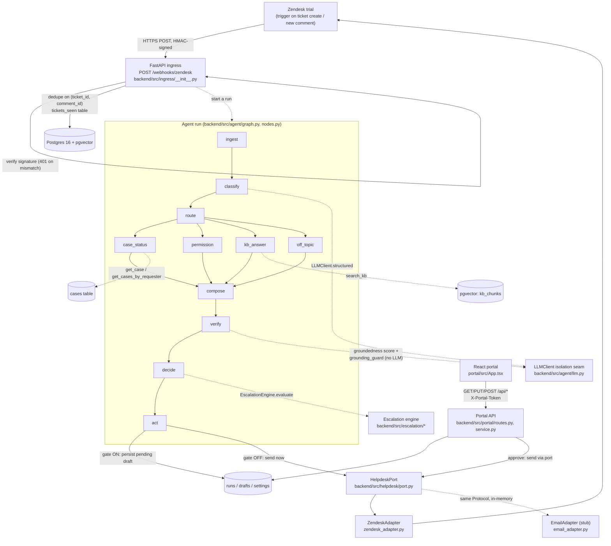

# Architecture

This document describes the system as it exists in the code today, with
file paths so you can navigate straight to the source. For requirements
and contracts, see [`docs/SPEC.md`](SPEC.md) and [`docs/DESIGN.md`](DESIGN.md);
this document is the "how it's actually built" view of the same system.

## System diagram



This is a more literal rendering of the same shape `docs/DESIGN.md`'s
architecture diagram pins — every box above names the real module that
implements it.

## Components

### Ingress — `backend/src/ingress/`

- `signature.py` — HMAC-SHA256 verification (`verify_signature`,
  `compute_signature`) over the **raw** request body, keyed by a
  base64-decoded signing secret. Uses `hmac.compare_digest` to avoid a
  timing side-channel.
- `models.py` — `ZendeskWebhookPayload`: the six-field pinned trigger
  payload (`ticket_id`, `comment_id`, `requester_email`, `subject`,
  `latest_comment_text`, plus `comment_author_id`, the one field T-4 added
  beyond DESIGN's pinned five, needed for the self-event drop below).
- `__init__.py` (`receive_zendesk_webhook`, mounted at `POST
  /webhooks/zendesk`) — the request handler. Each step is a hard gate on
  the next: (1) verify signature against the raw bytes — 401 on failure,
  nothing else runs; (2) parse/validate the payload — 400 on a malformed
  body, never 500; (3) self-event drop if `comment_author_id ==
  ZENDESK_AI_USER_ID`; (4) `INSERT ... ON CONFLICT DO NOTHING` into
  `tickets_seen`, keyed on `(ticket_id, comment_id)`, so idempotency is
  enforced by the table's primary key rather than a read-then-write race.

Ingress's job stops at "validated, deduped, accepted" (HTTP 202). It does
not itself invoke the agent graph.

### Agent core — `backend/src/agent/`

`graph.py` (`build_graph`, `run_agent`) compiles a `LangGraph`
`StateGraph` over the pinned pipeline:

```
ingest → classify → route → {case_status | permission | kb_answer | off_topic}
       → compose → verify → decide → act
```

Every node in `nodes.py` has the signature `(state: RunState, config:
RunnableConfig) -> dict[str, Any]` — a partial state update LangGraph
merges in. `ticket_id`, `HelpdeskPort`, `LLMClient`, and the
`EscalationDecider` are injected per-run via `config["configurable"]`
(`AgentDeps` in `nodes.py`), not baked into the compiled graph — the
compiled graph itself carries no state.

Node responsibilities, briefly:

- `ingest` — fetches the ticket and full conversation from the live port
  every run (`RunState` is never carried across runs — see "stateless
  context rebuild" below).
- `classify` — one `LLMClient.structured(Classification, ...)` call;
  decides `topic`, `route` (never `"escalate"` itself — see `agent/state.py`),
  `confidence`, and extracts an explicit `case_id` if the customer stated
  one verbatim.
- `case_status` / `permission` — resolve a `data.Case` via
  `data.get_case`/`data.get_cases_by_requester`, or forward an
  `unknown_case`/`out_of_procedure` condition to the escalation seam.
  `permission` also grounds its always-grant match in retrieved KB policy
  text (`search_kb`), never the model's own memory of policy.
- `kb_answer` — retrieves KB chunks (`data.search_kb`); an empty result
  forwards a `low_confidence` escalation trigger.
- `off_topic` — nothing to ground; `compose` fills the fixed redirect.
- `compose` — the **only** node that writes `state["draft"]`. Case facts
  reach it exclusively through `agent/templates.py`'s template-fill
  functions; free generation (an `LLMClient` call) happens only for
  `route == "kb"`. See `docs/grounding.md` for the full R9 story.
- `verify` — for `route == "kb"` only: scores groundedness
  (`GroundednessJudgment`) and runs `agent/grounding_guard.py`'s
  deterministic, no-LLM check. Either can force `route = "escalate"`.
- `decide` — reads the gate setting (`agent/store.py:read_gate_enabled`)
  and, for any run not already routed to `"escalate"`, runs the full
  escalation combinator (`EscalationDecider.evaluate`) — see
  `docs/escalation.md`.
- `act` — performs the `HelpdeskPort` calls (gate OFF) or persists the
  draft as `pending` (gate ON), and records a `runs` row
  (`agent/store.py:record_run`) plus a `drafts` row
  (`record_draft`).

### LLMClient isolation seam — `backend/src/agent/llm.py`

```python
class LLMClient(Protocol):
    def structured(self, schema: type[BaseModel], messages: list[dict],
                   temperature: float = 0.0) -> BaseModel: ...
```

Every model call in the graph — `classify`, `permission`'s policy match,
the `kb` route's answer draft, the groundedness judge, and the escalation
classifier — goes through this one Protocol. No node imports `openai`
directly. `OpenAILLMClient` (the production implementation, using
`chat.completions.parse` for strict structured outputs) constructs its
underlying `openai.OpenAI` client lazily, on first use, so merely
importing this module or instantiating the class never requires
`OPENAI_API_KEY`.

**This environment has no `OPENAI_API_KEY`.** `OpenAILLMClient` is
implemented but has never been exercised against the real OpenAI API.
Every graph/grounding/escalation test in the 222-test suite runs against
`FakeLLMClient` (`backend/tests/graph/fakes.py`), which returns canned
structured outputs keyed by schema class. The model version is pinned in
one place — `OPENAI_MODEL` in `backend/src/agent/config.py`
(`gpt-4o-mini-2024-07-18`) — never scattered through the graph.

### Helpdesk adapters — `backend/src/helpdesk/`

See `docs/portability.md` for the full boundary writeup. In short:
`port.py` defines the `HelpdeskPort` Protocol (7 methods); `models.py`
defines the normalized `Ticket`/`Message`/`MessageRef`/`EscalationGroup`
types; `zendesk_adapter.py` and `email_adapter.py` are the two
implementations.

### Data layer — `backend/src/data/`

- `schema.py` — idempotent DDL for every table (`init_schema`).
- `lookup.py` — typed case lookups (`get_case`, `get_cases_by_requester`);
  a miss returns `CaseNotFound`, never `None` and never an exception, so a
  caller is forced by the type system to branch on it.
- `retrieval.py` / `embeddings.py` — KB vector search (`search_kb`) over
  `kb_chunks`, using a **deterministic, offline `HashingEmbedder`**
  (`sklearn.feature_extraction.text.HashingVectorizer`, 1024-dim,
  L2-normalized) — not a semantic embedding model. This is a real,
  intentional choice (no `OPENAI_API_KEY` in this environment), not a
  placeholder nobody noticed; see `docs/grounding.md` for what that means
  for retrieval quality.
- `seed.py` / `chunking.py` — loads `fixtures/cases.yaml` (~30 fictional
  cases) and `fixtures/kb/*.md` (15 fictional KB docs) into Postgres.
- `models.py` — `Case`, `CaseNotFound`, `KBChunk`, `RetrievedChunk`.

### Escalation — `backend/src/escalation/`

See `docs/escalation.md` for the full methodology. Modules: `rules.py`
(deterministic hard-rule predicates), `classifier.py` (the
frustration/complexity `LLMClient` call), `engine.py`
(`EscalationEngine`, the combinator), `notes.py` (internal-note
composition), `config.py` (the provisional confidence threshold),
`schemas.py` (`EscalationCall`, `Reason`).

### Portal — `backend/src/portal/` + `portal/src/`

Backend: `routes.py` (thin FastAPI shim), `service.py` (the actual
feed/draft/gate/metrics logic — plain Python, testable without an HTTP
client), `schemas.py`, `auth.py` (`X-Portal-Token` shared-secret check on
every endpoint), `deps.py`. Frontend: `App.tsx` polls `/api/feed` and
`/api/metrics` every 5s; `components/GateToggle.tsx`,
`components/Feed.tsx`, `components/DraftDetail.tsx` (edit → approve/reject),
`components/MetricsPanel.tsx`.

### Eval tooling — `evals/` + `docs/eval-report/`

`evals/labeled_set.yaml` (51 fictional labeled tickets), `evals/report.py`
(confusion matrix / precision / recall / PR-curve generator), output in
`docs/eval-report/`. **Currently a draft** — see `docs/escalation.md`.

### Scenario runner — `scripts/live_smoke.py`

A human-run manual smoke tool that exercises every `HelpdeskPort`
operation once against a real Zendesk ticket. It is not CI-invoked and
not the same thing as T-10's live e2e scenario runner (which SPEC R8's
p95-latency measurement depends on); as of this writing it prints "no
Zendesk credentials" and exits 0 without making a network call, because
`ZENDESK_SUBDOMAIN`/`ZENDESK_OAUTH_TOKEN` are empty in this environment.
**No live Zendesk run of any kind has happened; R8's p95 latency is
unmeasured.** See `docs/demo-script.md` for what that blocks.

## Data model

From `backend/src/data/schema.py` (idempotent DDL, safe to re-run):

| Table | Purpose |
|---|---|
| `cases(case_id pk, requester_email, requester_name, stage, stage_entered_at, last_updated, eta_weeks, dna_profile_available, photos_available)` | Structured case-management data. Looked up directly — **never embedded into pgvector**; see `docs/grounding.md`. |
| `kb_chunks(id, doc_slug, chunk_index, text, embedding vector(1024))` | KB content only, chunked and embedded by `HashingEmbedder`. |
| `tickets_seen(ticket_id, comment_id, pk both)` | Ingress idempotency key. |
| `runs(id, ticket_id, route, confidence, outcome, verifier_score, trace_id, received_at, replied_at, reasons text[])` | One row per agent run — the portal feed and R13 metrics read from here. |
| `drafts(id, run_id, body, edited_body, status)` | One row per run (`pending`/`approved`/`rejected`/`auto_sent`). |
| `settings(key, value)` | Currently one row: the R11 gate (`gate_enabled`). |

## The two-layer loop guard

The system must never re-trigger on its own writes (SPEC R1). Two
independent layers enforce this:

1. **Trigger-level nullifier** (Zendesk side, human-configured per
   `docs/zendesk-runbook.md` Step 7): the trigger that fires the webhook
   carries the condition `Tags contains none of the following:
   ai-processed`. Every write `ZendeskAdapter` makes
   (`backend/src/helpdesk/zendesk_adapter.py:_update_ticket`) folds the
   tag `ai-processed` in unconditionally — there is no write path that
   skips it — so any ticket state the AI has touched is permanently
   excluded from firing the trigger again. `EmailAdapter` mirrors this
   with its own `_touch` method for the same reason (structural
   impossibility to forget, not per-call discipline).
2. **Ingress-level self-event drop** (`backend/src/ingress/__init__.py`):
   if the webhook payload's `comment_author_id` matches
   `ZENDESK_AI_USER_ID`, ingress accepts-and-noops without writing to
   `tickets_seen`. This is a second, independent guard against the same
   failure mode — not a substitute for layer 1, since Zendesk's trigger
   condition list doesn't offer a single clean "public comment from the
   requester specifically" field across all plan tiers.

`comment_author_id` is not one of DESIGN's five pinned webhook fields —
it's the one addition `backend/src/ingress/models.py` needed to make
layer 2 possible at all, fed by the `{{current_user.id}}` Zendesk
placeholder. It is load-bearing in two places at once
(`ingress/models.py` and the trigger JSON body in
`docs/zendesk-runbook.md`), so renaming it requires changing both in the
same change.

## Stateless context rebuild (R7)

`ingest` re-fetches the ticket and its full conversation from the live
port on **every** run — `RunState` (`backend/src/agent/state.py`) is
never persisted or reused across runs, and LangGraph's own checkpointing
is deliberately unused. This is a design decision (`docs/DESIGN.md`
"Decisions & rationale"), not an oversight: it keeps Zendesk as the sole
source of conversational truth and avoids drift between what the agent
believes happened and what actually did.

## What is and isn't exercised

The graph, escalation engine, grounding guard, portal API, and both
`HelpdeskPort` adapters are covered by 222 passing Python tests plus 5
portal component tests (`uv run pytest`, `cd portal && npx vitest run`),
all green, with `ruff check .` and `mypy backend` clean. What is **not**
exercised anywhere in this repo: a live OpenAI call, a live Zendesk call,
or a real end-to-end run through a deployed droplet. Every test above
drives the real graph and real Postgres, but with `FakeLLMClient` standing
in for OpenAI and (for most graph/grounding/escalation tests) `EmailAdapter`
standing in for `HelpdeskPort`. See `docs/portability.md` for why that
substitution is a meaningful proof rather than a shortcut, and
`docs/demo-script.md` for exactly what live-Zendesk verification is still
outstanding.
