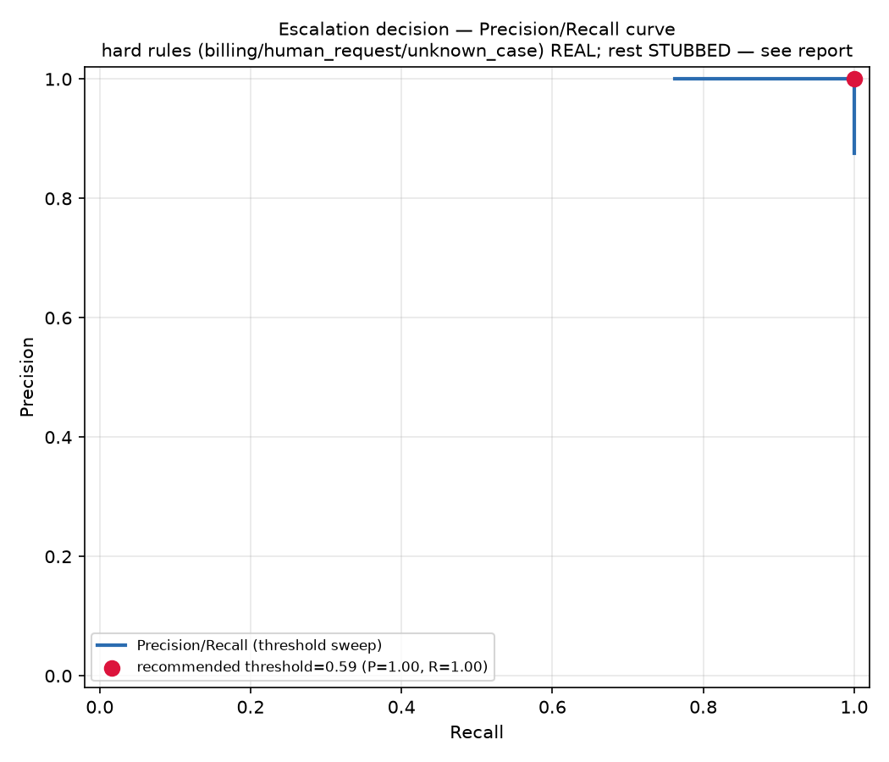

# Escalation eval report — T-7

**FINAL — labels approved (see evals/labeled_set.yaml's approval: block)**

Generated: 2026-08-15T22:03:14.513521+00:00
Labeled tickets: 51

## Methodology — what is REAL vs STUBBED

No `OPENAI_API_KEY` exists in this environment, and this script assumes no live Postgres/pgvector connection either, so only pure, deterministic checks are run for real:

- **REAL** — `rules.is_billing_dispute`, `rules.is_explicit_human_request`: 
  run directly against each ticket's body text.
- **REAL** — `rules.is_unknown_case`: a referenced `MFG-####-####` case id is checked 
  for membership in `fixtures/cases.yaml` directly (no live DB) — independent of the label.
- **STUBBED** — `rules.is_out_of_procedure`, both `low_confidence` subtypes (empty 
  retrieval, verifier failure), and `rules.is_classifier_abstention`: these need a live
  permission-matching LLM call, a live KB vector search, a live groundedness judge, or 
  a live classifier call respectively. A small replayable table stands in for the specific
  ticket ids authored to represent each scenario — see `evals/report.py`'s 
  `STUB_STRUCTURAL_REASON` / `STUB_ABSTENTION_IDS`.
- **STUBBED** — the escalation classifier's frustration/complexity verdict: a hand-authored,
  replayable `STUB_CLASSIFIER_VERDICTS` table, a few entries deliberately wrong relative to
  the label, so the confusion matrix below demonstrates real disagreement-handling rather
  than an uninformative all-correct diagonal.

**No number in this report should be read as a measurement of the real OpenAI-backed classifier's accuracy.**

## Label distribution

- Total tickets: 51
- Escalate: 21 / Not escalate: 30
- By route:
  - `case_status`: 10
  - `escalate`: 21
  - `kb`: 10
  - `off_topic`: 5
  - `permission`: 5
- By reason (a ticket can carry more than one):
  - `billing`: 4
  - `complexity`: 2
  - `frustration`: 3
  - `human_request`: 4
  - `low_confidence`: 5
  - `out_of_procedure`: 2
  - `unknown_case`: 2

## Confusion matrix (binary escalate / not-escalate, at recommended threshold)

| | Predicted escalate | Predicted no-escalate |
|---|---|---|
| **Actual escalate** | TP=21 | FN=0 |
| **Actual no-escalate** | FP=0 | TN=30 |

## Precision / Recall / F1 (at recommended threshold)

- Precision: 1.000
- Recall: 1.000
- F1: 1.000

## Hard-trigger subset recall

Recall on the 16 tickets labeled with a genuine DESIGN hard trigger (billing/human_request/unknown_case/out_of_procedure/low_confidence, excluding frustration/complexity-only escalations): **1.000**.
Under DESIGN's OR combinator, a fired hard rule is threshold-independent by construction, so this number is expected to be 1.0 whenever the predictor correctly identifies the trigger — it reflects the combinator's design (real for billing/human_request/unknown_case, stubbed-but-always-firing for out_of_procedure/low_confidence here), not classifier accuracy.

## Recommended threshold

Sweeping `CLASSIFIER_CONFIDENCE_THRESHOLD` over the STUBBED classifier scores above and maximizing F1 recommends **0.59** (current provisional value in `backend/src/escalation/config.py`: 0.50).
**This value is NOT written to `backend/src/escalation/config.py`.** Per T-7's own instructions, choosing a committed threshold requires human-approved labels — this report computes and states a recommendation only, against labels that are still `PROPOSED_AWAITING_HUMAN_REVIEW` and against a classifier that is entirely stubbed in this environment. Treat this number as a starting point for re-running this report once both are real, not as a number to commit.

## PR curve

## Per-ticket signal provenance

Every ticket's REAL vs STUBBED signals, for audit — see `evals/report.py` module docstring for definitions.

| id | expected | predicted | real signals | stubbed signals |
|---|---|---|---|---|
| `cs-intake-01` | no-escalate | no-escalate | — | classifier verdict [STUBBED]: escalate=False, confidence=0.00 |
| `cs-extraction-01` | no-escalate | no-escalate | — | classifier verdict [STUBBED]: escalate=False, confidence=0.00 |
| `cs-sequencing-01` | no-escalate | no-escalate | — | classifier verdict [STUBBED]: escalate=False, confidence=0.00 |
| `cs-genealogy-01` | no-escalate | no-escalate | — | classifier verdict [STUBBED]: escalate=False, confidence=0.00 |
| `cs-complete-01` | no-escalate | no-escalate | — | classifier verdict [STUBBED]: escalate=False, confidence=0.00 |
| `perm-add-contact-01` | no-escalate | no-escalate | — | classifier verdict [STUBBED]: escalate=False, confidence=0.00 |
| `perm-add-contact-02` | no-escalate | no-escalate | — | classifier verdict [STUBBED]: escalate=False, confidence=0.00 |
| `perm-resend-report-01` | no-escalate | no-escalate | — | classifier verdict [STUBBED]: escalate=False, confidence=0.00 |
| `perm-extend-retention-01` | no-escalate | no-escalate | — | classifier verdict [STUBBED]: escalate=False, confidence=0.00 |
| `perm-extend-retention-02` | no-escalate | no-escalate | — | classifier verdict [STUBBED]: escalate=False, confidence=0.00 |
| `kb-turnaround-01` | no-escalate | no-escalate | — | classifier verdict [STUBBED]: escalate=False, confidence=0.00 |
| `kb-refund-eligibility-01` | no-escalate | no-escalate | — | classifier verdict [STUBBED]: escalate=False, confidence=0.00 |
| `kb-billing-structure-01` | no-escalate | no-escalate | — | classifier verdict [STUBBED]: escalate=False, confidence=0.00 |
| `kb-rush-eligibility-01` | no-escalate | no-escalate | — | classifier verdict [STUBBED]: escalate=False, confidence=0.00 |
| `kb-retention-period-01` | no-escalate | no-escalate | — | classifier verdict [STUBBED]: escalate=False, confidence=0.00 |
| `kb-report-format-01` | no-escalate | no-escalate | — | classifier verdict [STUBBED]: escalate=False, confidence=0.00 |
| `kb-genealogy-limits-01` | no-escalate | no-escalate | — | classifier verdict [STUBBED]: escalate=False, confidence=0.00 |
| `kb-reextraction-explain-01` | no-escalate | no-escalate | — | classifier verdict [STUBBED]: escalate=False, confidence=0.00 |
| `kb-adversarial-invoice-mention-01` | no-escalate | no-escalate | — | classifier verdict [STUBBED]: escalate=False, confidence=0.00 |
| `kb-adversarial-human-mention-01` | no-escalate | no-escalate | — | classifier verdict [STUBBED]: escalate=False, confidence=0.00 |
| `off-weather-01` | no-escalate | no-escalate | — | classifier verdict [STUBBED]: escalate=False, confidence=0.00 |
| `off-unrelated-product-01` | no-escalate | no-escalate | — | classifier verdict [STUBBED]: escalate=False, confidence=0.00 |
| `off-greeting-01` | no-escalate | no-escalate | — | classifier verdict [STUBBED]: escalate=False, confidence=0.00 |
| `off-newsletter-01` | no-escalate | no-escalate | — | classifier verdict [STUBBED]: escalate=False, confidence=0.00 |
| `off-retail-unrelated-01` | no-escalate | no-escalate | — | classifier verdict [STUBBED]: escalate=False, confidence=0.00 |
| `esc-billing-double-charge-01` | escalate | escalate | billing [REAL: rules.is_billing_dispute] | — |
| `esc-billing-wrong-amount-01` | escalate | escalate | billing [REAL: rules.is_billing_dispute] | — |
| `esc-billing-refund-demand-01` | escalate | escalate | billing [REAL: rules.is_billing_dispute] | — |
| `esc-human_request-direct-01` | escalate | escalate | human_request [REAL: rules.is_explicit_human_request] | — |
| `esc-human_request-polite-01` | escalate | escalate | human_request [REAL: rules.is_explicit_human_request] | — |
| `esc-human_request-bot-callout-01` | escalate | escalate | human_request [REAL: rules.is_explicit_human_request] | — |
| `esc-combined-billing-human_request-01` | escalate | escalate | billing [REAL: rules.is_billing_dispute]; human_request [REAL: rules.is_explicit_human_request] | — |
| `esc-unknown_case-nonexistent-id-01` | escalate | escalate | unknown_case [REAL: 'MFG-2025-9999' absent from fixtures/cases.yaml] | — |
| `esc-unknown_case-nonexistent-id-02` | escalate | escalate | unknown_case [REAL: 'MFG-2099-0001' absent from fixtures/cases.yaml] | — |
| `esc-out_of_procedure-change-requester-01` | escalate | escalate | — | out_of_procedure [STUBBED: replayed label — needs a live permission matcher / KB search / groundedness judge this report does not run] |
| `esc-out_of_procedure-early-deletion-01` | escalate | escalate | — | out_of_procedure [STUBBED: replayed label — needs a live permission matcher / KB search / groundedness judge this report does not run] |
| `esc-low_confidence-empty_retrieval-accreditation-01` | escalate | escalate | — | low_confidence [STUBBED: replayed label — needs a live permission matcher / KB search / groundedness judge this report does not run] |
| `esc-low_confidence-empty_retrieval-international-01` | escalate | escalate | — | low_confidence [STUBBED: replayed label — needs a live permission matcher / KB search / groundedness judge this report does not run] |
| `esc-low_confidence-verifier_failure-exact-date-01` | escalate | escalate | — | low_confidence [STUBBED: replayed label — needs a live permission matcher / KB search / groundedness judge this report does not run] |
| `esc-low_confidence-verifier_failure-summed-timeline-01` | escalate | escalate | — | low_confidence [STUBBED: replayed label — needs a live permission matcher / KB search / groundedness judge this report does not run] |
| `esc-low_confidence-abstention-garbled-01` | escalate | escalate | — | classifier abstention [STUBBED: no OPENAI_API_KEY in this environment; replayed for this id] |
| `esc-frustration-repeated-emails-01` | escalate | escalate | — | classifier verdict [STUBBED]: escalate=True, confidence=0.88 |
| `esc-frustration-furious-01` | escalate | escalate | — | classifier verdict [STUBBED]: escalate=True, confidence=0.93 |
| `esc-frustration-repeated-asks-01` | escalate | escalate | — | classifier verdict [STUBBED]: escalate=True, confidence=0.81 |
| `esc-frustration-borderline-mild-01` | no-escalate | no-escalate | — | classifier verdict [STUBBED]: escalate=True, confidence=0.55 |
| `esc-frustration-borderline-impatient-01` | no-escalate | no-escalate | — | classifier verdict [STUBBED]: escalate=False, confidence=0.70 |
| `esc-frustration-borderline-near-window-01` | no-escalate | no-escalate | — | classifier verdict [STUBBED]: escalate=True, confidence=0.45 |
| `esc-complexity-entangled-rush-two-cases-01` | escalate | escalate | — | classifier verdict [STUBBED]: escalate=True, confidence=0.75 |
| `esc-complexity-entangled-failure-timeline-shipping-01` | escalate | escalate | — | classifier verdict [STUBBED]: escalate=True, confidence=0.70 |
| `esc-complexity-borderline-two-part-01` | no-escalate | no-escalate | — | classifier verdict [STUBBED]: escalate=False, confidence=0.65 |
| `esc-complexity-borderline-stalled-01` | no-escalate | no-escalate | — | classifier verdict [STUBBED]: escalate=True, confidence=0.58 |

---
**FINAL — labels approved (see evals/labeled_set.yaml's approval: block)**
